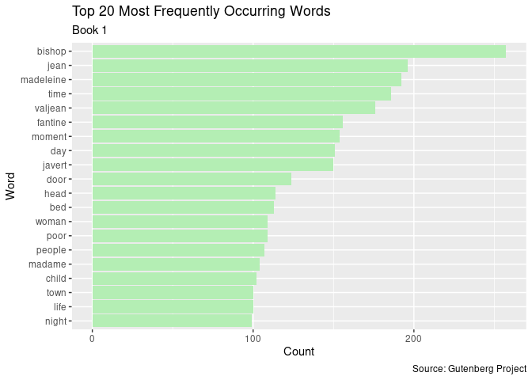
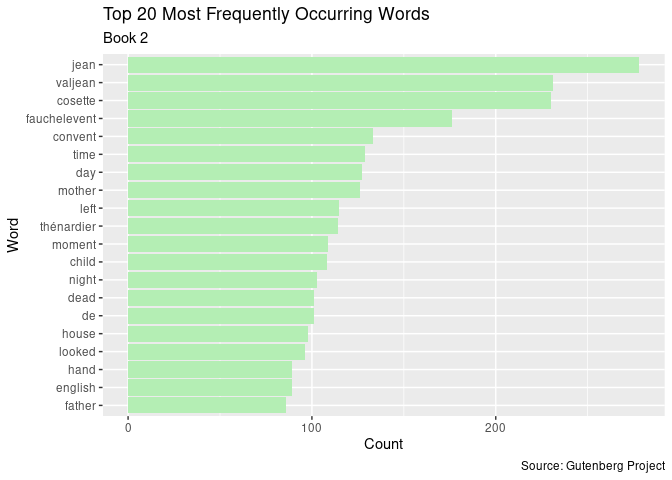
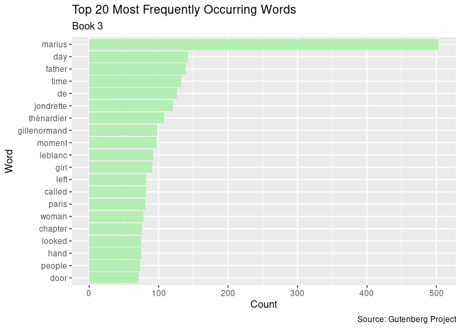
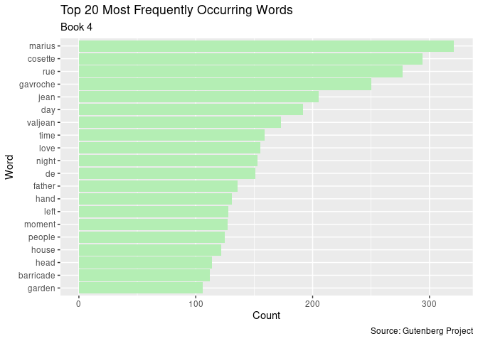
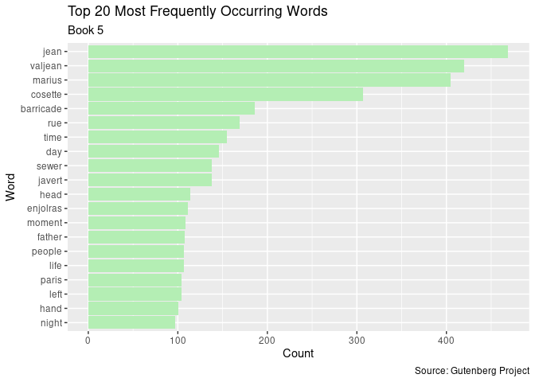

Text Analysis
================
Eva Wu

-   [Load the Data](#load-the-data)
-   [Most Frequently Occurring Words](#most-frequently-occurring-words)
-   [Sentiment Analysis](#sentiment-analysis)
-   [Wordclouds](#wordclouds)

## Load the Data

``` r
# write a function to load text data from each book
get_text <- function(id) {
  text <- gutenberg_download(id) %>%
    unnest_longer(col = text) %>%
    unnest_tokens(input = text, output = word) %>%
    anti_join(stop_words)
}

# check the id of the Les Miz books
metadata <- gutenberg_works(author == "Hugo, Victor") %>%
  filter(gutenberg_id > 48730 & gutenberg_id <= 48735) %>%
  select(gutenberg_id, author, title)

# iterate the get_text function 5 times to get the full text of all 5 Les Miz books
all_text <- map_df(.x = metadata$gutenberg_id, .f = get_text)
```

## Most Frequently Occurring Words

``` r
# write another function to visualize the count of the top 20 
# most frequently occurring words in each book
count_frequency <- function(id) {
  all_text %>%
    filter(gutenberg_id == id) %>%
    count(word, sort = TRUE) %>%
    slice_head(n = 20) %>%
    mutate(word = reorder(word, n)) %>%
    ggplot(aes(n, word)) +
    geom_col(fill = "darkseagreen2") +
    labs(title = "Top 20 Most Frequently Occurring Words", 
         subtitle = paste("Book", (id - 48730)),
         x = "Count", 
         y = "Word",
         caption = "Source: Gutenberg Project")
}

# iterate the count_frequency function 5 times to compare the results across 5 Les Miz books
map(.x = metadata$gutenberg_id, .f = count_frequency)
```

    ## [[1]]

<!-- -->

    ## 
    ## [[2]]

<!-- -->

    ## 
    ## [[3]]

<!-- -->

    ## 
    ## [[4]]

<!-- -->

    ## 
    ## [[5]]

<!-- -->

As we can see from the graphs, Book 1 mentions bishop, time, moment,
day, door, head, bed, woman, poor, people, child, etc. most often. Book
2 mentions convent, time, day, mother left, moment, child, night, dead,
house, etc. most often. Book 3 mentions day, time, father, moment, girl,
left, called, paris, woman, etc. most often. Book 4 mentions rue, day,
time, love, night, father, hand, left, moment, people, barricade, etc.
most often. Book 5 mentions barricade, rue, time, sewer, head, moment,
father, people, etc. most often. We can tell that concepts such as
moment, day, time, etc. are always among the top 20 most frequently
occurring words across all 5 books. We can also see that the first book
is centered around Jean Valjean, Fantine, and Javert, the second book
around Jean Valjean, Cosette, and Thénardier, the third book around
Marius and Thénardier, the fourth around Marius, Cosette, Gavroche, and
Jean Valjean, and the fifth around Jean Valjean, Marius, Cosette, and
Javert. It is obvious that as the plot develops, the theme switches from
the plight of poor Fantine as a single mother to the love between
Cosette and Marius, and then to the revolution.

## Sentiment Analysis

``` r
all_text %>%
  inner_join(get_sentiments("afinn")) %>%
  mutate(book_number = gutenberg_id - 48730) %>%
  group_by(book_number) %>%
  summarize(sentiment = mean(value)) %>%
  ggplot(aes(book_number, sentiment, fill = sentiment)) +
  geom_col() +
  coord_flip() +
  labs(
    title = "Sentiment Across 5 Books of Les Misérables",
    subtitle = "By book",
    y = "Average Sentiment",
    x = "Book",
    fill = "Average Sentiment",
    caption = "Source: Gutenberg Project"
  )
```

<!-- -->

From this graph we can see that the general sentiment is fairly negative
across all books. However, book 2 is the most negative one among all 5.
Book 3 is the least negative one. Combined with information provided in
the above section, we can tell that the part describing the unfortunate
experience of Cosette is more negative, while the part where Marius
comes in is less negative.

## Wordclouds

``` r
all_text %>%
  count(word) %>%
  with(wordcloud(word, n, max.words = 200))
```

<!-- -->

From this wordcloud we can see that Jean, Marius and Cosette are
mentioned most often. This makes sense because they are the main
characters of this story. It is also worth noticing that Paris, death,
barricade, and people are quite frequently mentioned, and they have to
do with the French Revolution, one of the major themes of the story.
Another theme is love, demonstrated by the frequently mentioned words
such as mother, father, love, wife, and heart. However, I notice that
this wordcloud changes every time I run the code, so my analysis might
not be the most accurate one.
